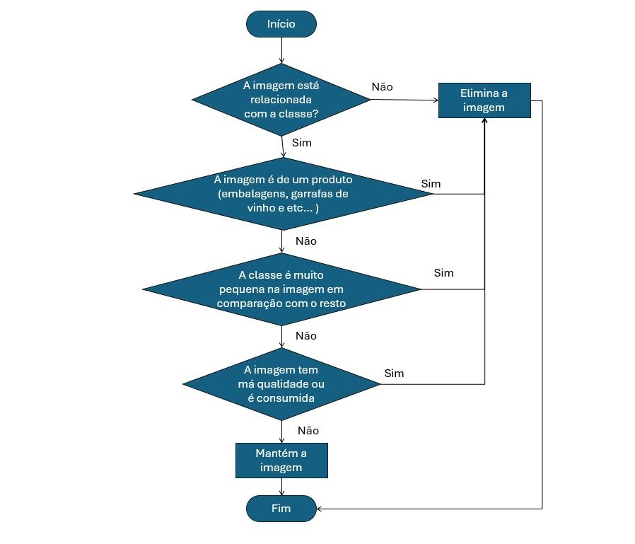

# Dataset de Pratos Típicos da Gastronomia Portuguesa
Este dataset contém 100 classes, cada uma representando um prato típico da gastronomia portuguesa. Foram selecionadas 100 classes de comida típica portuguesa, utilizando uma ferramenta especializada para recolher rapidamente as imagens necessárias diretamente do Google.

## Coleta de Imagens
A ferramenta utilizada é uma extensão disponível nos navegadores Microsoft Edge, Mozilla Firefox e Google Chrome, chamada "Download All Images". Esta extensão permite uma recolha de imagens rápida e eficiente diretamente da Google, adicionando um botão de ação à barra de ferramentas do navegador e dando-lhe acesso a várias opções de filtragem de imagens.
As principais funcionalidades da ferramenta incluem a filtragem de imagens com base em critérios como dimensões, tipo de imagem, tamanho em bytes e URL. Para este dataset, a ferramenta foi configurada para selecionar apenas imagens que atendam ao requisito mínimo de 200 pixels por 200 pixels, garantindo assim uma resolução adequada.

## Processo de Verificação Manual
Após a coleta automática, foi realizada uma verificação manual para garantir que cada imagem estivesse corretamente ordenada e representasse o prato correspondente. Cada imagem foi visualmente revisada para confirmar a sua adequação à classe atribuída. As imagens que não correspondiam ao prato esperado foram removidas.

## Resultado
Numero de classes: 100​

 Total de imagens: 10.000 ​

 Total de imagens por cada classe: 100 

Para meu projeto, utilizei este dataset para treinar um modelo de deep learning com o objetivo de identificar pratos típicos da culinária portuguesa.

 Projeto: https://github.com/RafaelRibeiro2003/Deep-learning-com-dataset-de-comida-portuguesa)">Deep-learning-com-dataset-de-comida-portuguesa

A coleta de imagens diretamente do Google para criar um dataset levanta questões legais importantes relacionadas a direitos autorais e uso justo. As imagens disponíveis na Internet, incluindo as encontradas através do Google Imagens, estão geralmente protegidas por direitos de autor. Isto significa que a utilização destas imagens sem a devida autorização pode constituir uma violação dos direitos dos proprietários das imagens. Neste trabalho, é necessário reconhecer estes direitos e abordar as potenciais desvantagens da utilização de imagens obtidas desta forma. O uso de imagens para fins comerciais ou públicos sem permissão pode resultar em ações legais por parte dos detentores de direitos autorais.

## Lista de 100 Classes do dataset portuguesa
1. Alheira
2. Amêijoas
3. Arroz de Cabidela
4. Arroz de Feijão
5. Arroz de Pato
6. Arroz de Polvo
7. Arroz de Tomate
8. Arroz-doce
9. Azeitonas
10. Azevias
11. Bacalhau à Brás
12. Bacalhau à Lagareiro
13. Bacalhau com Broa
14. Bacalhau com Natas
15. Bacalhau com Todos
16. Bifana
17. Bitoque
18. Bola de Berlim
19. Bolinhas de Alheira
20. Bolo de Arroz
21. Bolo de Bolacha
22. Bolo de Cenoura
23. Bolo de Chocolate
24. Bolo de Mel da Madeira
25. Bolo Rainha
26. Bolo Rei
27. Brisas do Lis
28. Cabrito Assado
29. Caldeirada de Peixe
30. Canja
31. Caracóis
32. Cataplana de Marisco
33. Cavacas
34. Chanfana
35. Choco Frito à Moda de Setúbal
36. Chocos Grelhados
37. Cogumelos Salteados
38. Coscorões
39. Cozido à Portuguesa
40. Crepes
41. Enguias Fritas
42. Ensopado de Borrego
43. Entrecosto Grelhado
44. Esparguete à Bolonhesa
45. Espetadas
46. Farinheira com Ovos
47. Farturas
48. Feijoada
49. Filetes de Pescada
50. Fios de Ovos
51. Folar de Páscoa
52. Folhados de Salsicha
53. Francesinha
54. Frango Assado
55. Grelhada Mista
56. Lampreia de Ovos
57. Lasanha
58. Leitão
59. Leite-Creme
60. Maranhos
61. Melão com Presunto
62. Mexilhão
63. Migas
64. Mil-folhas
65. Moelas Estufadas
66. Mousse de Chocolate
67. Omelete
68. Ovos Moles
69. Pampilhos
70. Panados
71. Pão-de-Ló
72. Pastéis de Bacalhau
73. Pastel de Nata
74. Pastel de Tentúgal
75. Pataniscas de Bacalhau
76. Patê
77. Dourada
78. Pimentos Recheados
79. Polvo à Lagareiro
80. Pudim
81. Queijada de Sintra
82. Regueifa Doce
83. Rojões
84. Salada
85. Salada de Fruta
86. Salada de Polvo
87. Salame de Chocolate
88. Salmão
89. Sardinhas Assadas
90. Sericaia
91. Serradura
92. Sopa Alentejana
93. Sopa de Caldo Verde
94. Sopa de Tomate
95. Suspiros
96. Tarte de Amêndoa
97. Toucinho-do-céu
98. Travesseiro de Noiva
99. Tronco de Natal
100. Waffles
